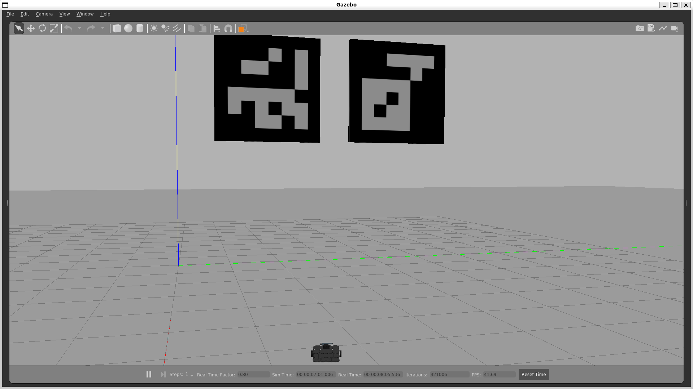
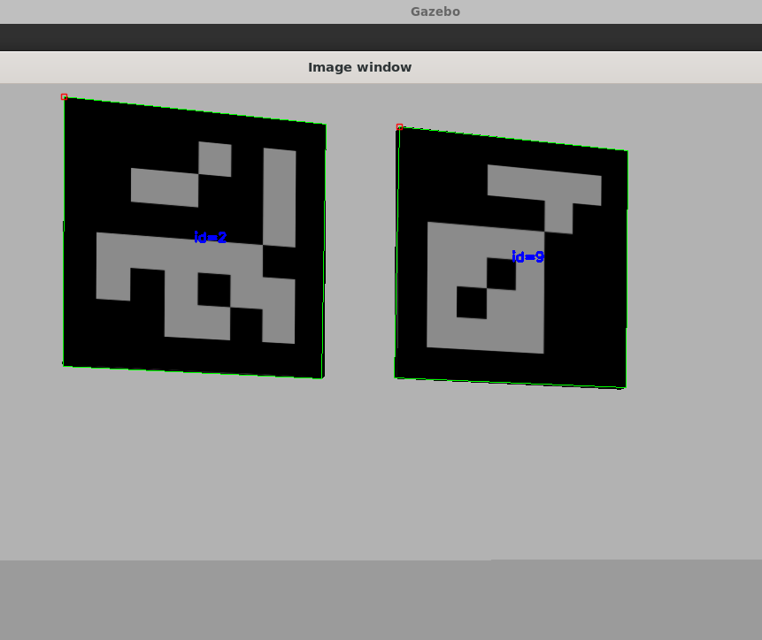

# Aruco Marker Detection with OpenCV and TurtleBot3 in Gazebo

## Task Overview

This task involves detecting Aruco markers in two different cases:

1. **Real-world video detection:** Using OpenCV to detect Aruco markers in a video recorded from a mobile camera.
2. **Simulation in Gazebo:** Using TurtleBot3 to detect Aruco markers in a simulated Gazebo environment.

## Table of Contents

1. [Prerequisites](#prerequisites)
2. [Setup](#setup)
3. [Real-World Video Detection](#real-world-video-detection)
4. [Gazebo Simulation](#gazebo-simulation)
6. [Results](#results)
7. [Images](#images)
8. [References](#references)

## Prerequisites

Ensure you have the following software installed:

- Python 3.x
- OpenCV
- ROS (Robot Operating System) with TurtleBot3 packages
- Gazebo
- Git

## Setup

Clone the project repository:

```bash
git clone https://github.com/rishang19dx/Task_3A_Aruco_Marker_Detection.git
cd Task_3A_Aruco_Marker_Detection
```

### Real-World Video Detection

1. **Print Aruco Markers:**
   - Print the provided Aruco markers on an A4 sheet.

2. **Record Video:**
   - Record a video of the printed Aruco markers using your mobile camera. Move the camera around to capture different angles and distances.
   - Save the video as `aruco.mp4` in the project directory.
   - Add the path to the python script.

### Gazebo Simulation

1. **Install Required Packages:**
   - Install the necessary ROS and Gazebo packages.
   - Clone the `gazebo_aruco_models` package from GitHub:

     ```bash
     git clone https://github.com/sacchinbhg/gazebo_aruco_models.git
     cd gazebo_aruco_models
     cp -r aruco_marker /path/to/your/catkin_ws/src/
     cd /path/to/your/catkin_ws
     catkin_make
     source devel/setup.bash
     ```

2. **Launch Gazebo with TurtleBot3 and Aruco Markers:**
   - Open Gazebo simulation in empty world and add the aruco markers using the insert tab in the Gazebo GUI
   - We shall use waffle model because it has in-built camera in it.
     
     ```bash
     export TURTLEBOT3_MODEL=waffle
     roslaunch turtlebot3_gazebo turtlebot3_empty_world.launch
     ```
     

## Real-World Video Detection

1. **Python Script:**
   - Navigate to the task directory.
   - Run the provided Python script `aruco.py` to detect Aruco markers in the video

## Gazebo Simulation

1. **Launch TurtleBot3 in Gazebo:**
   - Use the following command to launch the simulation:

     ```bash
     export TURTLEBOT3_MODEL=waffle
     roslaunch turtlebot3_gazebo turtlebot3_empty_world.launch
     ```

2. **Spawn Aruco Markers:**
   - Use the Gazebo GUI and add markers to the environment.

3. **Run Detection Node:**
   - Run the detection node to detect Aruco markers using TurtleBot3's camera:

     ```bash
     rosrun aruco_detection aruco_detection.py
     ```
4. **View Camera Images :**
   - View images from the TurtleBot3's camera topic `/camera/rgb/image_raw` using `image_view`
     
     ```bash
     rosrun image_view image_view image:=/camera/rgb/image_raw
     ```
     

## Results

- **Real-World Video Detection:**
  - The script will display the video with detected Aruco markers highlighted.

- **Gazebo Simulation:**
  - The detection node will output the positions of the detected Aruco markers in the simulation and highlight the same in the simulation.

## Images

### Aruco Markers in gazebo environment


### Aruco Markers Detection



## References

- [OpenCV Aruco Module Documentation](https://docs.opencv.org/4.x/d9/d6a/group__aruco.html)
- [TurtleBot3 Documentation](https://emanual.robotis.com/docs/en/platform/turtlebot3/overview/)
- [Gazebo Aruco Models](https://github.com/sacchinbhg/gazebo_aruco_models)

---
